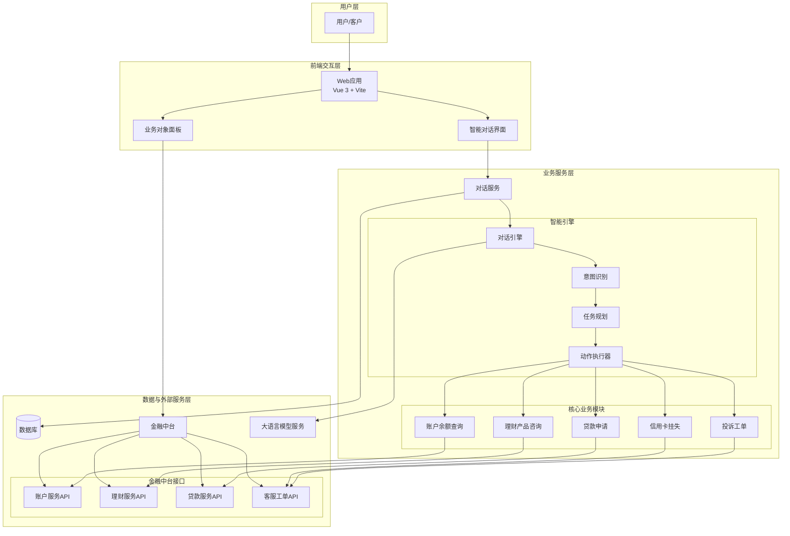
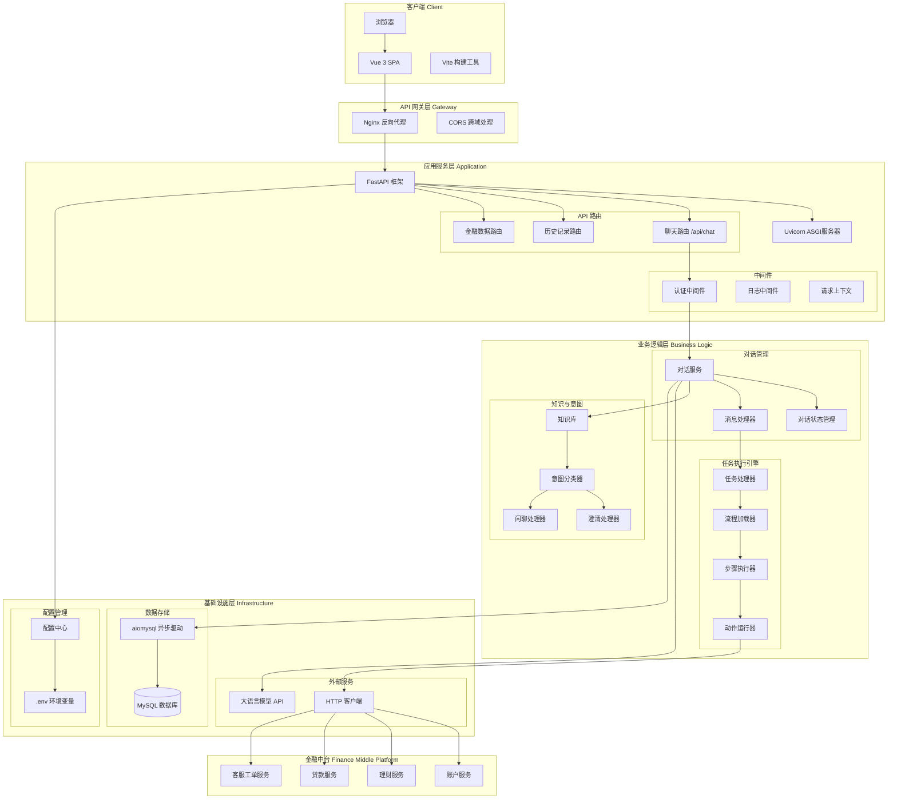
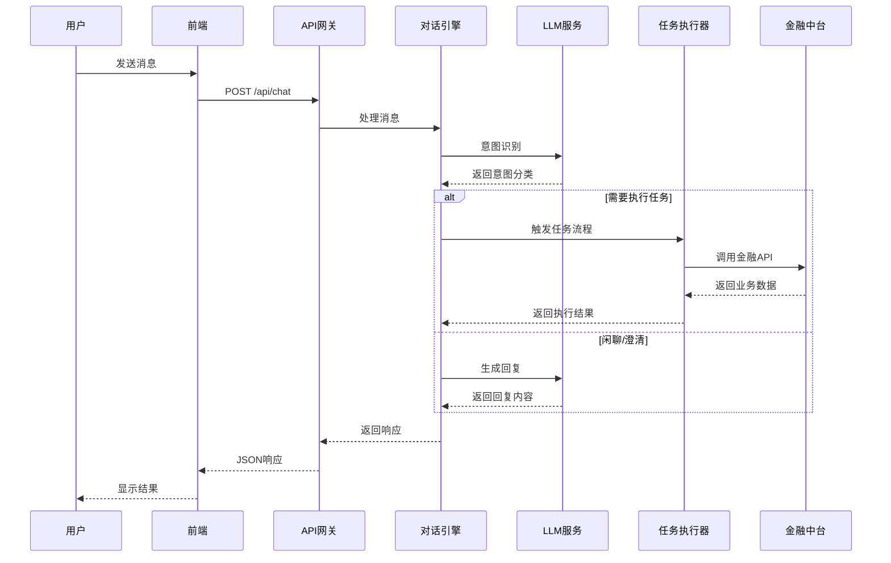

# 智能金融客服系统 - 架构设计文档

## 1. 业务架构图



## 2. 技术架构图



## 3. 核心业务流程图



## 4. 业务功能模块说明

### 4.1 核心业务功能

| 功能模块 | 说明 | 对应Action类 |
|---------|------|-------------|
| 账户余额查询 | 查询客户银行账户余额信息 | `LookUpAccountBalanceAction` |
| 交易记录查询 | 查询账户交易流水记录 | `LookUpTransactionAction` |
| 理财产品咨询 | 查询和推荐理财产品 | 通过金融中台API |
| 贷款申请 | 提交贷款申请流程 | `SubmitLoanApplicationAction` |
| 信用卡挂失 | 信用卡紧急挂失处理 | `SubmitCreditCardLossAction` |
| 投诉工单 | 创建客户服务投诉工单 | `CreateComplaintTicketAction` |

### 4.2 智能对话能力

- **意图识别**: 基于LLM的自然语言理解
- **任务规划**: 自动规划多步骤业务流程
- **槽位提取**: 从对话中提取业务参数
- **上下文管理**: 维护多轮对话状态
- **知识库**: 金融产品知识问答

## 5. 技术栈汇总

| 层级 | 技术选型 |
|------|---------|
| 前端框架 | Vue 3 + Composition API |
| 构建工具 | Vite |
| 后端框架 | FastAPI (Python) |
| ASGI服务器 | Uvicorn |
| 数据库 | MySQL |
| 数据库驱动 | aiomysql (异步) |
| AI服务 | 大语言模型 (LLM) |
| HTTP客户端 | httpx/aiohttp |

## 6. 部署架构

```
┌─────────────────────────────────────────────────────────┐
│                    生产环境部署                           │
├─────────────────────────────────────────────────────────┤
│  前端: Nginx 静态资源服务                                │
│  后端: Uvicorn + FastAPI (多worker)                      │
│  数据库: MySQL 主从集群                                  │
│  缓存: Redis (可选)                                      │
│  AI服务: LLM API 云端调用                               │
└─────────────────────────────────────────────────────────┘
```
